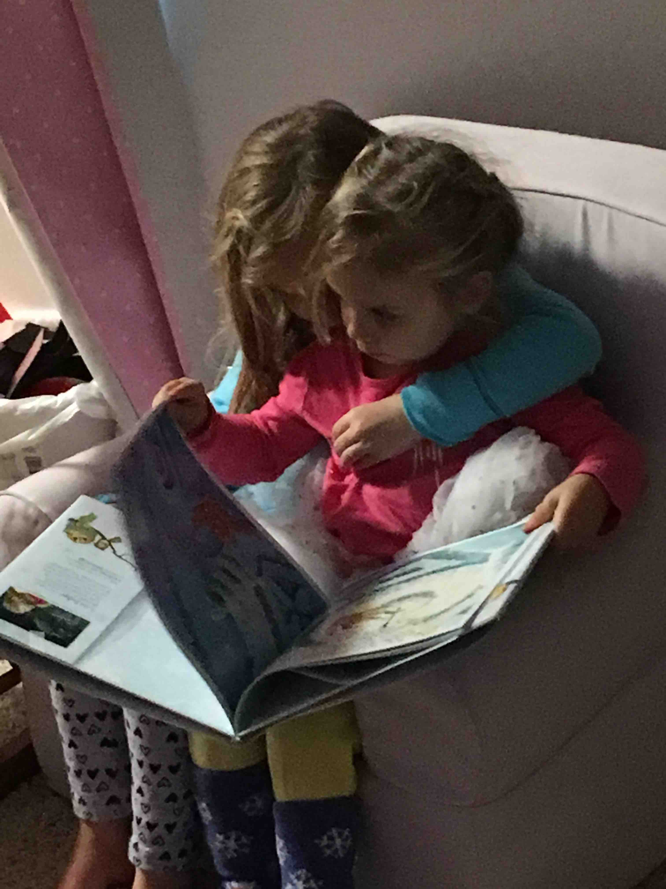
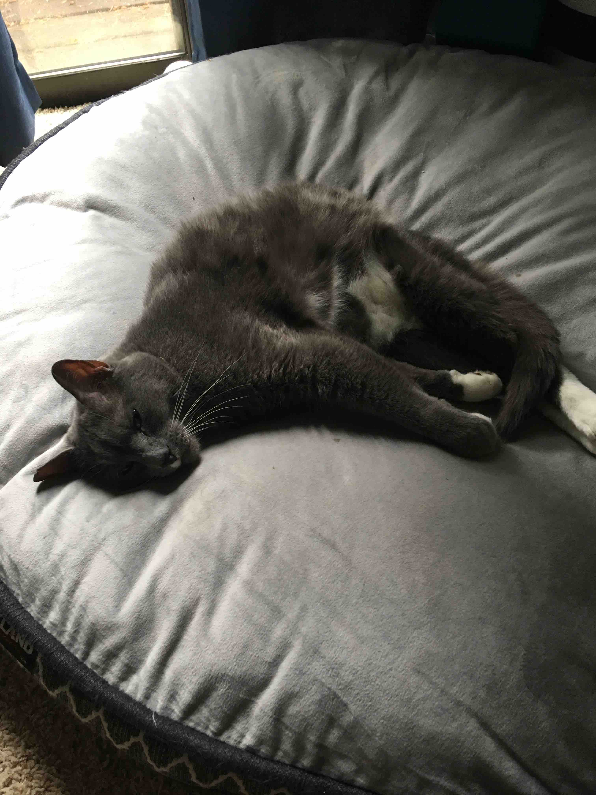
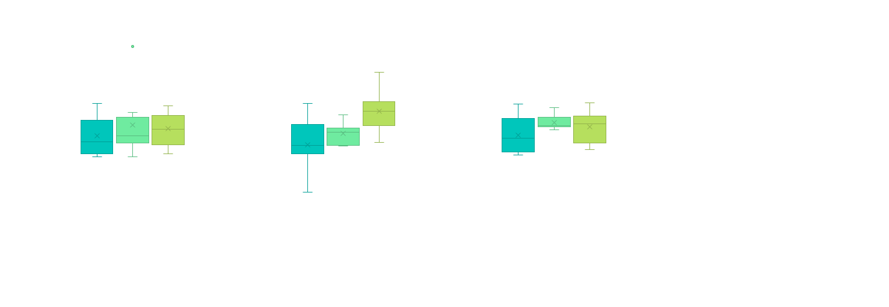

##  Here’s the title for the first slide 

+ This is an unusually deeply nested list, that starts with weird levels
	+ Of bullets
		+ And more bullets
		+ And even more
		+ Back a level
	+ Back to the first level
No bulleting at all
+ New set of bullets that also don’t start at first level


##  A picture! 

This is some text with a picture on the right. Those are my two girls. They’re the cutest.



##  Two pictures in one slide 

This slide has some text and two pictures. It still works
{width=43.5275281648062%}{width=43.5275281648062%}

##  Lots of pictures! 

If we have more than two pictures, it starts to not work very well, so it defaults to putting them all on their own slides as background images.


{width=25.3278561883864%}{width=25.3278561883864%}{width=25.3278561883864%}

##  A Table 


```{r tbl5, echo = FALSE}
tbl5 <- tibble::tribble(
~`Variable`, ~`Coefficient`, ~`Standard Error`,
"Intercept","250.57","0.78",
"height","10.4","2.53",
"weight","8.7","6.89",
"age","0.50","0.04"
)

kableExtra::kable_styling(knitr::kable(tbl5), font_size = 18)
```

##  Bold and italics 

+ Here’s some bold text and here’s some italicized text on the same line
	+ But yet… It parses them both, even when they’re bold and italicized!!!

##  Links 

+ Links are preserved as well. For example, you can see a link to the development version of this package here .
[here](https://github.com/datalorax/slidex)

##  Line Plot! 


##  Bar Plot 


##  Histogram 


##  Box Plot 



##  A brilliant flow chart 


##  Two-Panel Layout 

+ Content on the left
	+ And content on the right

##  That’s all for now 

Thanks for your interest!
